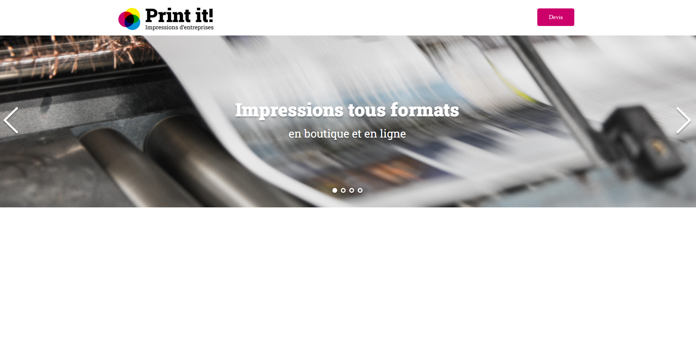

# Print it

- Ce travail a été réalisé dans le cadre du projet n°5 de la formation Intégrateur Web d’OpenClassrooms.

- Print it est une entreprise de services d'impression en ligne.
- Ce dépôt contient le code du prototype du site dont l'objectif est de :
	- • ajouter un carrousel de bannières interactives,
	- • permettre le défilement dynamique d'images.

## Outils et langages pour la réalisation du projet

- Le projet a été réalisé en **HTML**, **CSS** et **JavaScript**.
